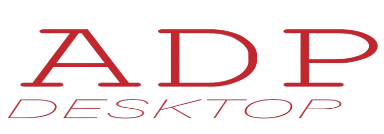

[](https://pub.dartlang.org/packages/adp_desktop)
[](https://github.com/Abbas1Hussein/adp_desktop/blob/main/LICENSE)
[](https://github.com/Abbas1Hussein/adp_desktop/stargazers)
[](https://github.com/Abbas1Hussein/adp_desktop/network)

<p align="center">  </p>

Use this package to create adaptive apps on desktop. With just one codebase, you can preview your app on both Windows and macOS platforms, regardless of the device you're used.

## Usage
First, you need to initialize the `DefaultsPlatformManager`. Here's how you can do it:

```dart
import 'package:adp_desktop/adp_desktop.dart';
import 'package:flutter/foundation.dart';

void main() async {
  DefaultsPlatformManager.initialize(
    // Specify the target platform (Windows or macOS)
    targetPlatform: DesktopTargetPlatform.windows,
    // If set to false, the targetPlatform parameter will be ignored, and the specific widget behavior will depend on the base platform.
    isDebugging: !kReleaseMode,
  );

  /// root widget of your Flutter application is `AdpApp()`.
  runApp(const App());
}
```

## Table of Contents

<details>
<summary>Buttons</summary>

### Basic Buttons

- [General Button](#general-buttons)
- [Icon Button](#icon-button)
- [Text Button](#text-button)

### Menus

- [Pulldown Menu Button](#pulldown-menu-button)
- [Popup Menu Button](#popup-menu-button)

### Selection Buttons

- [Checkbox](#checkbox)
- [Switch Button](#switch-button)
- [Radio Button](#radio-button)

### Navigation Buttons

- [Back Button](#back-button)
- [Close Button](#close-button)

### Window Control Buttons

<a href="#window-buttons-section">Window Buttons</a>
<ul>
    <li><a href="#close-window-button-section">Close Window Button</a></li>
    <li><a href="#minimize-window-button-section">Minimize Window Button</a></li>
    <li><a href="#maximize-window-button-section">Maximize Window Button</a></li>
</ul>


</details>

<details>
<summary>Fields</summary>

  - [Text Field](#text-field)
  - [Text Form Field](#text-form-field)
  - [Text Search Field](#text-search-field)
</details>

<details>
<summary>Icon</summary>
<a href="#Icon-section">Icon</a>
<ul>
    <li><a href="#basic-adaptive-icon-section">Basic Adaptive Icon</a></li>
    <li><a href="#platform-specific-icon-section">Platform-Specific Icon</a></li>
    <li><a href="#consistent-icon-across-platforms-section">Consistent Icon Across Platforms</a></li>
</ul>
<a href="#Icons-section">Icons</a>

</details>

<details>
<summary>Indicators</summary>

  - [Circular Progress Indicator](#circular-progress-indicator)
  - [Progress Bar](#progress-bar)
  - [Rating Indicator](#rating-indicator)
  - [Slider](#slider)
</details>

<details>
<summary>Layout</summary>

  - [Scaffold](#scaffold)
  - [Scaffold Page](#scaffold-page)
  - [Title Bar](#title-bar)
</details>

<details>
<summary>Navigation</summary>

  - [Navigation View](#navigation-view)
  - [Tab View](#tab-view)
</details>

<details>
<summary>Pickers</summary>

  - [Date Picker](#date-picker)
  - [Time Picker](#time-picker)
</details>

<details>
<summary>Surfaces</summary>

  - [Dialog](#dialog)
  - [Bottom Sheet](#bottom-sheet)
  - [List Tile](#list-tile)
  - [Tooltip](#tooltip)
</details>

<details>
<summary>Additional</summary>

  - [adaptiveValue](#adaptiveValue)
  - [AdaptiveBuilder](#adaptive-builder-widget)
  - [AdaptiveWidget](#adaptive-widget)
  - [AdaptiveBrightness](#brightness)
  - [AdaptiveTypography](#typography)
  - [Color's](#colors)
  - [Contributing](#contributing)
  - [Acknowledgements](#acknowledgements)

</details>

## Buttons

### General Buttons
| MacOS Dark\Light Mode                                | Windows Dark\Light Mode                                |
|------------------------------------------------------|--------------------------------------------------------|
|   |   |
|  |  |

#### Base Button
This is a basic button that serves as a fundamental interactive element in the user interface.
It typically triggers primary actions or functions when clicked or tapped.
The base button doesn't have any specific visual styles beyond the default button appearance provided by the platform.

```dart
AdaptiveButton(
  child: const Text('Base Button'),
  onPressed: () {},
),
```

#### Field Button
A field button is similar to a base button but is optimized for use within form fields or input areas.
It may have slightly different visual properties to indicate its association with a form, such as a different background color or border style.

```dart
AdaptiveButton.field(
  child: const Text('Field Button'),
  onPressed: () {},
),
```

#### Outlined Button
A button with an outline border, providing a subtle visual cue compared to solid buttons.
It often represents secondary actions or less prominent options.

```dart
AdaptiveButton.outlined(
  child: const Text('Outlined Button'),
  onPressed: () {},
),
```

#### Icon Button
It is one of the most widely used buttons in the flutter library typically contains an icon.
It is commonly used to trigger actions or events in response to user interaction, such as tapping or clicking.
If the onPressed callback is null, then the button will be disabled and will not react to touch.

| MacOS Dark\Light Mode                                | Windows  Dark\Light Mode                               |
|------------------------------------------------------|--------------------------------------------------------|
|   |   |
|  |  |

```dart
AdaptiveIconButton(
  onPressed: () {},
  icon: const AdaptiveIcon(AdpIcons.add),
),
```

#### Text Button
A textButton widget is just a text label displayed on a zero-elevation Material widget.
By default, it does’t have visible borders and reacts to touches by filling with a background color.
If the onPressed && onLongPress callbacks is null, then the button will be disabled and will not react to touch.

| MacOS Dark\Light Mode                                | Windows  Dark\Light Mode                               |
|------------------------------------------------------|--------------------------------------------------------|
|   |   |
|  |  |

```dart
AdaptiveTextButton(
  onPressed: () {},
  child: const Text('Text Button'),
),
```

### Menus

#### Pulldown Menu Button
A pull-down menu button is used to create a nice overlay on the screen, allowing the user to select an item from multiple options.
The `AdaptivePulldownMenuButton.singleChoice` constructor option focuses on only one `AdaptivePulldownMenuItem`.
If `enabled` is true, it will be focused. There should be exactly one item with the specified 'enabled' value set to true.

| MacOS Dark\Light Mode                                | Windows  Dark\Light Mode                               |
|------------------------------------------------------|--------------------------------------------------------|
|   |   |
|  |  |

```dart
AdaptivePulldownMenuButton(
  title: 'pulldown menu',
  items: [
    AdaptivePulldownMenuItem(
      leading: AdaptiveIcon(AdpIcons.folderAdd),
      child: Text('New folder'),
    ),
    AdaptivePulldownMenuItem(
      leading: AdaptiveIcon(AdpIcons.folderOpen),
      child: Text('Open'),
    ),
    AdaptivePulldownMenuItem(
      leading: AdaptiveIcon(AdpIcons.wand),
      child: Text('Open with'),
    ),
    AdaptivePulldownMenuItem(
      leading: AdaptiveIcon(AdpIcons.delete),
      child: Text('Remove'),
      enabled: false, // this will disabled.
    ),
    AdaptivePulldownMenuItem(
      leading: AdaptiveIcon(AdpIcons.phone),
      child: Text('Import from phone ...'),
    ),
    AdaptivePulldownMenuDivider(),
    AdaptivePulldownMenuItem(
      leading: AdaptiveIcon(AdpIcons.star),
      child: Text('Give us a star'),
    ),
  ],
),
```

#### Popup Menu Button
A pop-up button (often referred to as a pop-up menu) is a type of button
that, when clicked, displays a menu containing a list of mutually exclusive choices.
A pop-up button includes a double-arrow indicator that alludes to the
direction in which the menu will appear (only vertical is currently supported).

| MacOS Dark\Light Mode                                | Windows  Dark\Light Mode                               |
|------------------------------------------------------|--------------------------------------------------------|
|   |   |
|  |  |

```dart
AdaptivePopupMenuButton<int>(
  value: _currentValue,
  onChanged: (value) {
    setState(() {
      _currentValue = value!;
    });
  },
  items: const [
    AdaptivePopupMenuItem(value: 0, child: Text('Blue')),
    AdaptivePopupMenuItem(value: 1, child: Text('Green')),
    AdaptivePopupMenuItem(value: 2, child: Text('Red')),
    AdaptivePopupMenuItem(value: 3, child: Text('Yellow')),
    AdaptivePopupMenuItem(value: 4, child: Text('Purple')),
    AdaptivePopupMenuItem(value: 5, child: Text('Orange')),
  ],
),
```

### Selection Buttons

#### Checkbox
A checkbox is a type of button that lets the user choose between
two opposite states, actions, or values. A selected checkbox is
considered on when it contains a checkmark and off when it's empty.
A checkbox is almost always followed by a title unless it appears in
a checklist.

| MacOS Dark\Light Mode                                | Windows  Dark\Light Mode                               |
|------------------------------------------------------|--------------------------------------------------------|
|   |   |
|  |  |

```dart
AdaptiveCheckbox(
  value: _checkboxValue,
  onChanged: (value) {
    setState(() {
      _checkboxValue = value;
    });
  },
),
```

#### Switch Button
The switch represents a physical switch that allows users to turn
things on or off, like a light switch. Use switch controls to present
users with two mutually exclusive options (such as on/off), where choosing an option provides immediate results.
Use a switch for binary operations that take effect right after the
user flips the switch,Think of the switch as a physical power switch for a device: you flip
it on or off when you want to enable or disable the action performed by the device.

| MacOS Dark\Light Mode                                | Windows  Dark\Light Mode                               |
|------------------------------------------------------|--------------------------------------------------------|
|   |   |
|  |  |

```dart
AdaptiveSwitch(
  value: _currentValue,
  onChanged: (bool newValue) {
    setState(() {
      _currentValue = newValue;
    });
  },
),
```

#### Radio Button
Also called option buttons, let users select one option from
a collection of two or more mutually exclusive, but related, options. Radio
buttons are always used in groups, and each option is represented by one radio button in the group.
In the default state, no radio button in a RadioButtons group is selected.
That is, all radio buttons are cleared. However, once a user has selected a
radio button, the user can't deselect the button to restore the group to its
initial cleared state.
The singular behavior of a RadioButtons group distinguishes it from check
boxes, which support multi-selection and deselection, or clearing.

| MacOS Dark\Light Mode                                | Windows Dark\Light Mode                                |
|------------------------------------------------------|--------------------------------------------------------|
|   |   |
|  |  |

```dart
AdaptiveRadio<SingingCharacter>(
  value: SingingCharacter.lafayette,
  groupValue: _character,
  onChanged: (SingingCharacter? newValue) {
    setState(() {
      _character = newValue;
    });
  },
),
```

### Navigation Buttons

#### Back Button
The back button is a user interface element used to navigate to the previous screen or step in an application's flow.
It provides users with a way to return to the previous context or view.

```dart
AdaptiveBackButton(),
```

#### Close Button
The close button is a user interface element used to dismiss or close a window, dialog, or modal.
It allows users to exit the current context or cancel an action.

```dart
AdaptiveCloseButton(),
```

## 🪟 Window Control Buttons <a id="window-buttons-section"></a>
Window control buttons are essential elements of any graphical user interface.  
They allow users to interact with and manage application windows on their operating system.  
Each platform provides its own set of control buttons, It automatically adapts its design to match the host operating system and can be customized to suit your app’s needs.

| macOS (Dark / Light)                                 | Windows (Dark / Light)                                 |
|------------------------------------------------------|--------------------------------------------------------|
|   |   |
|  |  |

```dart
AdaptiveWindowButtons(),
````

#### 🟥 Close Window Button <a id="close-window-button-section"></a>

Closes or terminates the active window.

```dart
AdaptiveCloseButton(),
```

#### 🟨 Minimize Window Button <a id="minimize-window-button-section"></a>

Minimizes the active window, reducing it to the taskbar or dock.

```dart
AdaptiveMinimizeButton(),
```

#### 🟩 Maximize Window Button <a id="maximize-window-button-section"></a>

Maximizes or restores the active window to fill the available screen space.

```dart
AdaptiveMaximizeButton(),
```

## Fields

### Text Field
The TextField widget in Flutter is a fundamental input component used to collect text input from the user,
it allows users to enter and edit text interactively.

| MacOS Dark\Light Mode                                | Windows  Dark\Light Mode                               |
|------------------------------------------------------|--------------------------------------------------------|
|   |   |
|  |  |

```dart
AdaptiveTextField(),
```

### Text Form Field
The TextFormField widget in Flutter is an enhanced version of the TextField widget,
specifically designed to be used within a Form widget to enable form validation and submission.

| MacOS Dark\Light Mode                                | Windows  Dark\Light Mode                               |
|------------------------------------------------------|--------------------------------------------------------|
|   |   |
|  |  |

```dart
Form(
  key: _formKey,
  child: AdaptiveTextFormField(
    validator: (value) {
      if (value == null || value.isEmpty) {
        return 'Please enter some text';
      }
      return null;
    },
    onFieldSubmitted: (value) {
      _formKey.currentState?.validate();
    },
  ),
),
```

### Text Search Field
A Text Search Field with Auto Suggestion is a user interface component typically used in applications
to allow users to input text queries and receive real-time suggestions or predictions based on the entered text.
It combines a text input field with a dropdown or list of suggestions that dynamically updates as the user types.

This widget provides a convenient way for users to find relevant information quickly without having to type the entire query themselves.
It enhances the user experience by offering predictive text suggestions, which can save time and effort.

| MacOS Dark\Light Mode                                | Windows  Dark\Light Mode                               |
|------------------------------------------------------|--------------------------------------------------------|
|   |   |
|  |  |

```dart
AdaptiveTextSearchField(
  suggestions: [
    AdaptiveSearchItem(searchKey: 'John Doe'),
    AdaptiveSearchItem(searchKey: 'Jane Smith'),
    AdaptiveSearchItem(searchKey: 'Michael Johnson'),
    AdaptiveSearchItem(searchKey: 'Emily Davis'),
    AdaptiveSearchItem(searchKey: 'Daniel Brown'),
    AdaptiveSearchItem(searchKey: 'Olivia Wilson'),
    AdaptiveSearchItem(searchKey: 'James Taylor'),
    AdaptiveSearchItem(searchKey: 'Alexander Anderson'),
    AdaptiveSearchItem(searchKey: 'Emma Garcia'),
    AdaptiveSearchItem(searchKey: 'Sophia Martinez'),
  ],
),
```
## Icon

### 🎨 Icon <a id="Icon-section"></a>

Icons are graphical symbols used to represent actions, objects, or concepts within an application's user interface.  
They provide visual cues that help users quickly understand and interact with the interface.


#### 1. Basic Adaptive Icon <a id="basic-adaptive-icon-section"></a>
A simple adaptive icon that automatically adjusts its appearance to match the current platform style.

```dart
AdaptiveIcon(AdpIcons.app),
````

#### 2. Platform-Specific Icon <a id="platform-specific-icon-section"></a>
An adaptive icon with platform-specific designs for **Windows** and **macOS**.

```dart
AdaptiveIcon.from(
  wICON: _iconWindowsData,
  mICON: _iconMacosData,
),
```

#### 3. Consistent Icon Across Platforms <a id="consistent-icon-across-platforms-section"></a>
An icon that remains consistent across all platforms.

```dart
AdaptiveIcon.all(Icons.code),
```

### 🧱 Icons <a id="Icons-section"></a>

`Icons` are a collection of predefined graphical symbols that represent common actions, objects, or concepts.
They provide visual cues that help users quickly understand and interact with the interface.

```dart
final AdpIcons adpIcon = AdpIcons.app;

// You can get the platform-specific IconData using `.platform`.
final IconData iconData = adpIcon.platform, 
```

## Indicators

### Circular Progress Indicator
A progress widget that shows progress in a circular form,
A progress control provides feedback to the user that a long-running
operation is underway. It can mean that the user cannot interact with the
app when the progress indicator is visible, and can also indicate how long
the wait time might be.

It can be determinate or indeterminate:
If `value` is non-null, it should be between 0 and 100, representing the progress percentage.
If `value` is null, the circular progress will be considered indeterminate,
indicating that the progress is ongoing without a specific completion percentage.

| MacOS Dark\Light Mode                                | Windows  Dark\Light Mode                               |
|------------------------------------------------------|--------------------------------------------------------|
|   |   |
|  |  |

```dart
AdaptiveCircularProgressIndicator(),
```

### Progress Bar
A progress widget that shows progress in a horizontal bar,
A progress control provides feedback to the user that a long-running
operation is underway. It can mean that the user cannot interact with the
app when the progress indicator is visible, and can also indicate how long
the wait time might be.

It can be determinate or indeterminate:
If `value` is non-null, it should be between 0 and 100, representing the progress percentage.
If `value` is null, the circular progress will be considered indeterminate,
indicating that the progress is ongoing without a specific completion percentage.

| MacOS Dark\Light Mode                                | Windows  Dark\Light Mode                               |
|------------------------------------------------------|--------------------------------------------------------|
|   |   |
|  |  |

```dart
AdaptiveProgressBarIndicator(),
```

### Rating Indicator
The rating bar allows users to view and set ratings that reflect degrees of satisfaction with content and services,
users can interact with the rating control with touch, pen, mouse, gamepad or keyboard.
The follow guidance shows how to use the rating control's features to provide flexibility and customization.

| MacOS Dark\Light Mode                                | Windows  Dark\Light Mode                               |
|------------------------------------------------------|--------------------------------------------------------|
|   |   |
|  |  |

```dart
AdaptiveRatingIndicator(
  amount: 5, // Total number of rating units
  rating: _rating, // Current rating value
  onChanged: (value) {
    setState(() {
      _rating = value;
    });
  },
),
```

### Slider
A slider is a control that lets the user select from a range of values by
moving a thumb control along a track, A slider is a good choice when you know that users think of the value as a
relative quantity, not a numeric value. For example, users think about
setting their audio volume to low or medium — not about setting the value to
2 or 5.

| MacOS Dark\Light Mode                                | Windows  Dark\Light Mode                               |
|------------------------------------------------------|--------------------------------------------------------|
|   |   |
|  |  |

```dart
AdaptiveSlider(
  value: _currentValue,
  onChanged: (value) {
    setState(() {
      _currentValue = value;
    });
  },
),
```


## Layout

### Scaffold
We use this from the material library and adaptive it,
The scaffold is designed to be a top level container for a `AdpApp`.
This means that adding a Scaffold to each route on a adp app will provide the app with
platform's basic visual layout structure.

| MacOS Dark\Light Mode                                | Windows  Dark\Light Mode                               |
|------------------------------------------------------|--------------------------------------------------------|
|   |   |
|  |  |
```dart
AdaptiveScaffold(
  appBar: AdaptiveAppBar(title: const Text('appbar')),
  drawer: AdaptiveDrawer(
    child: ListView(
      children: List.generate(
        labels.length,
        (index) {
          return Padding(
            padding: const EdgeInsets.all(8.0),
            child: AdaptiveListTile(
              useBackgroundColor: index == 0,
              leading: AdaptiveIcon(icons[index]),
              title: labels[index],
            ),
          );
        },
      ),
    ),
  ),
  floatingActionButton: FloatingActionButton(
    onPressed: () {},
    child: const AdaptiveIcon(AdpIcons.add),
  ),
  body: Center(
    child: AdaptiveButton(
      child: const Text("back"),
      onPressed: () => Navigator.pop(context),
    ),
  ),
),
```
### Scaffold Page
The scaffold Page is a variant of the Scaffold widget designed specifically for use as a top-level container for individual pages within the app.
It includes an app bar with customizable actions and a content area for displaying the main content of the page.

| MacOS Dark\Light Mode                                | Windows  Dark\Light Mode                               |
|------------------------------------------------------|--------------------------------------------------------|
|   |   |
|  |  |

```dart
AdaptiveScaffoldPage(
  appBar: AdaptiveAppBarPage(
    title: const Text('Appbar Page'),
    actions: List.generate(
      labels.length,
      (index) {
        return AdaptiveActionButton(
          label: labels[index],
          icon: AdaptiveIcon(icons[index]),
          onPressed: () {},
        );
      },
    ),
  ),
  content: const Center(child: Text("Give us a star")),
),
```

### Title Bar
The Title Bar is a visual element typically located at the top of an application window or screen.
It often contains the application's name or logo and may include additional controls or indicators.

#### 🧩 Basic Configuration

You can easily customize the title bar from within the `AdpApp` widget by providing your desired configuration.

```dart
AdpApp(
  titleBarConfig: AdaptiveTitleBarConfig(
    height: 34.0,
    appIcon: const AdaptiveIcon(AdpIcons.app),
    appTitle: const Text('appTitle'),
    mode: TitleBarMode.normal,
  ),
),
````

#### 🎨 Advanced Customization

If you need deeper customization, set the `TitleBarMode` to `hidden` inside `AdpApp`.
Then, use the `AdaptiveTitleBar` widget on specific screens to create your own custom title bar.

```dart
AdaptiveTitleBar(
  config: AdaptiveTitleBarConfig(
    height: 35.0,
    appTitle: const Text('appTitle'),
    appIcon: const AdaptiveIcon(AdpIcons.app),
  ),
  child: _scaffoldPage(),
),
```
You can also create your own custom `AdaptiveTitleBar` to fit your app’s design and layout.

## Navigation

### Navigation View
The Navigation View top-level navigation for your app provides a structured layout for navigation within an application.
It typically consists of a sidebar for navigation options and an app bar for additional controls or indicators.
Provides a flexible layout for navigation purposes, allowing users to interact with the app's content seamlessly,
making it suitable for various application designs and platforms. [View full example](http://github.com/Abbas1Hussein/adp_desktop/blob/master/example/lib/src/view/screens/home/tabs/navigation/navigation_view.dart)

| MacOS Dark\Light Mode                                | Windows  Dark\Light Mode                               |
|------------------------------------------------------|--------------------------------------------------------|
|   |   |
|  |  |

```dart
AdaptiveNavigationView(
  appBar: AdaptiveNavigationAppBar(
    title: const Text('Abbas Hussein'),
    actions: [
      AdaptiveActionButton(
        onPressed: () {},
        label: 'Add',
        icon: const AdaptiveIcon(AdpIcons.add),
      ),
      AdaptiveActionButton(
        onPressed: () {},
        label: 'Delete',
        icon: const AdaptiveIcon(AdpIcons.delete),
      ),
      AdaptiveActionButton(
        onPressed: () {},
        label: 'Edit',
        icon: const AdaptiveIcon(AdpIcons.edit),
      ),
      AdaptiveActionButton(
        onPressed: () {},
        label: 'Download',
        icon: const AdaptiveIcon(AdpIcons.download),
      ),
    ],
  ),
  sidebar: AdaptiveNavigationSidebar(
    currentIndex: currentIndex,
    onChanged: (value) {
      setState(() => currentIndex = value);
    },
    items: items,
  ),
  children: List.generate(
    items.length,
    (index) => Center(
      child: AdaptiveButton(
        child: items[index].label,
        onPressed: () => Navigator.pop(context),
      ),
    ),
  ),
),
```

### Tab View
The tab view is top-level for your app, facilitates the organization of content into separate tabs,
enabling users to navigate between different sections of the application.
It provides a visually appealing and intuitive way to present and switch between related information.
The Tab View consists of tabs along with their corresponding content, making it easy for users to access specific sections quickly.
This widget is customizable and adaptable, suitable for various application designs and platforms. [View full example](https://github.com/Abbas1Hussein/adp_desktop/blob/master/example/lib/src/view/screens/home/tabs/navigation/tab_view.dart)

| MacOS Dark\Light Mode                                | Windows  Dark\Light Mode                               |
|------------------------------------------------------|--------------------------------------------------------|
|   |   |
|  |  |

```dart
AdaptiveTabView(
  currentIndex: currentIndex,
  onChanged: (value) {
    setState(() => currentIndex = value);
  },
  tabs: tabs,
  children: List.generate(
    tabs.length,
    (index) => Center(
      child: AdaptiveButton(
        child: tabs[index].label,
        onPressed: () => Navigator.pop(context),
      ),
    ),
  ),
),
```

## Pickers

### Date Picker
A date picker is a graphical user interface element that used to select a date from a graphical calendar interface.
It allows users to easily choose a specific date by clicking or tapping on the desired day within the calendar.
Date pickers provide options for navigating between months and years. They are widely used in various applications,
including scheduling, event management, and form submissions, to facilitate the input of dates with accuracy and efficiency.

| MacOS Dark\Light Mode                                | Windows  Dark\Light Mode                               |
|------------------------------------------------------|--------------------------------------------------------|
|   |   |
|  |  |

```dart
AdaptiveDatePicker(
  initialDate: DateTime.now(),
  onSelected: (value) {
    print(value.toIso8601String());
  },
),
```

### Time Picker
A time picker is a user interface component that allows users to select a specific time of day, typically in hours and minutes.
It provides a graphical interface for users to adjust the hour and minute values using sliders or input fields.
Time pickers are commonly used in applications that require scheduling or setting reminders, enabling users to choose precise times for events or tasks.

| MacOS Dark\Light Mode                                | Windows  Dark\Light Mode                               |
|------------------------------------------------------|--------------------------------------------------------|
|   |   |
|  |  |

```dart
AdaptiveTimePicker(
  initialTime: TimeOfDay.now(),
  onSelected: (value) {
    print(value.format(context));
  },
),
```

## Surfaces

### Dialog
A dialog is a user interface element that appears on top of the main content to prompt the user for information or to confirm an action.
It typically contains a title, optional content, and one or more action buttons for the user to interact with.
Dialogs are commonly used to display alerts, messages, warnings, or to request input from the user.
They provide a way to temporarily interrupt the user's workflow and require their attention before proceeding.

| MacOS Dark\Light Mode                                | Windows  Dark\Light Mode                               |
|------------------------------------------------------|--------------------------------------------------------|
|   |   |
|  |  |

```dart
AdaptiveButton(
  child: const Text('Show Dialog'),
  onPressed: () {
    showAdpDialog(
      context: context,
      builder: (context) {
        return AdaptiveDialog(
          title: const SizedBox.shrink(),
          content: const SizedBox.shrink(),
          /// on macOS appearance always remains constant
          primary: AdaptiveButton(
            child: const Text(''),
            onPressed: () => Navigator.pop(context),
          ),
          /// on macOS appearance always remains constant
          secondary: AdaptiveButton(
            child: const Text(''),
            onPressed: () => Navigator.pop(context),
          ),
        );
      },
    );
  },
),
```

### Bottom Sheet
A bottom sheet is a type of dialog the screen to provide additional information or actions.
It typically contains content that is not essential for the current context but may be useful for the user.
Bottom sheets are commonly used to display menus, settings, or supplementary information without blocking the main content of the application.

```dart
AdaptiveButton(
  child: const Text('Show Bottom Sheet'),
  onPressed: () {
    showAdpBottomSheet(
      context: context,
      builder: (context) {
        return const AdaptiveBottomSheet(
          child: Center(child: Text('Hello Word')),
        );
      },
    );
  },
),
```

### List Tile
The list tiles are used to represent a single piece of information, typically within a list or grid layout.
They provide a compact and structured way to display data, often including an icon, title, and additional details.

| MacOS Dark\Light Mode                                | Windows  Dark\Light Mode                               |
|------------------------------------------------------|--------------------------------------------------------|
|   |   |
|  |  |

```dart
AdaptiveListTile(
  leading: const AdaptiveIcon(AdpIcons.info),
  title: Text(DummyText.generateQuestion),
  subtitle: Text(DummyText.generateAnswer),
  trailing: AdaptiveIconButton(
    onPressed: () {},
    icon: const AdaptiveIcon(AdpIcons.ellipsesVert),
  ),
),
```

### Tooltip
A tooltip is a popup that contains additional information about another
control or object. Tooltips display automatically when the user moves focus
to, presses and holds, or hovers the pointer over the associated control.
The tooltip disappears when the user moves focus from, stops pressing on, or
stops hovering the pointer over the associated control (unless the pointer is moving towards the tooltip).

```dart
AdaptiveTooltip(
  message: 'copy',
  child: AdaptiveIconButton(
    onPressed: () {},
    icon: const AdaptiveIcon.all(Icons.copy),
  ),
),
```

## Additional

### adaptiveValue
Utilize to execute platform-specific actions. 
```dart
AdaptiveButton(
  child: const Text('Pick File'),
  onPressed: () {
    adaptiveValue(
      web: _handelPickWebFile,
      macos: _handelPickMacOSFile,
      windows: _handelPickWindowsFile,
    );
  },
),
```

### Adaptive Widget
Widget that provides platform-specific child.
```dart
AdaptiveWidget(
  onMacos: (context) => const Text('onMacos'),
  onWindows: (context) => const Text('onWindows'),
)
```

### Adaptive Builder Widget
Widget that adapts its child's appearance based on the platform.

```dart
AdaptiveBuilderWidget(
  builders: AdaptiveBuilder(
    macos: (platformChild, theme, property) {
      return ColoredBox(
        color: theme.canvasColor,
        child: Padding(
          padding: const EdgeInsets.all(8.0),
          child: platformChild,
        ),
      );
    },
    windows: (platformChild, theme, property) {
      return ColoredBox(
        color: theme.inactiveColor,
        child: Padding(
          padding: const EdgeInsets.all(8.0),
          child: platformChild,
        ),
      );
    },
  ),
  child: const Text('Abbas1Hussein'),
),
```

### Colors
represents the adaptive color value.
```dart
final color = AdpColors.red;
```

### Typography
The text style, it's obtained by accessing the typography settings.
This likely adjusts the text style based on the current platform.
```dart
final typography = AdaptiveTypography.of(context);
```

### Brightness
To retrieves the brightness mode (light or dark) of the current platform.
It's using this to get the brightness mode.
```dart
final brightness = AdaptiveBrightness.of(context);
```

---
### 🤝 Contributing <a id="contributing"></a>

We welcome all contributions whether it's through **Pull Requests**, **Issues**,
Your feedback and collaboration help this project grow and improve.

If you’d like to contribute:

* Open a new issue for bugs or feature requests.
* Submit a pull request with improvements or fixes.
* Read our [CONTRIBUTING.md](CONTRIBUTING.md) for guidelines and best practices.

Every contribution, big or small, is greatly appreciated.

---
### 🙏 Acknowledgements <a id="acknowledgements"></a>

Special thanks to the maintainers and contributors of the following amazing packages:

* [macos_ui](https://pub.dev/packages/macos_ui)
* [fluent_ui](https://pub.dev/packages/fluent_ui)

Your work made cross-platform adaptation possible.

---
### 📜 License
This project is licensed under the [MIT License](LICENSE).